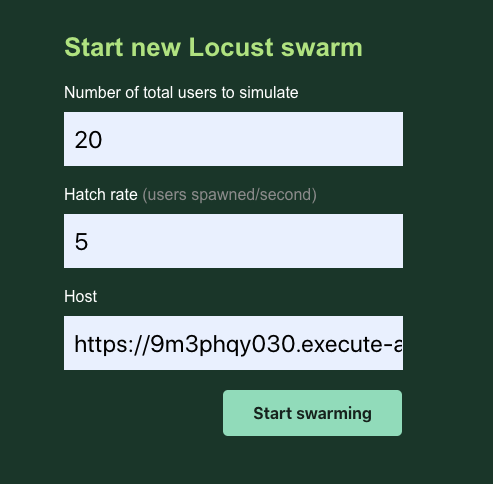
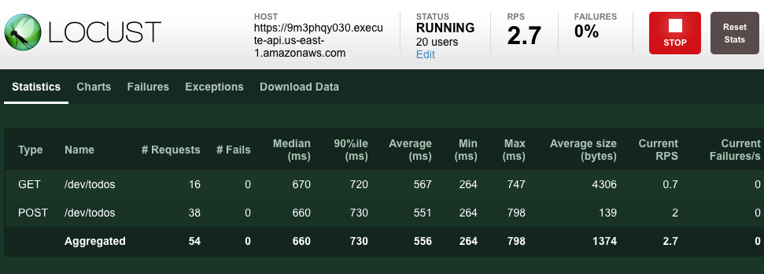

# run locust test on api gateway

### Usage

1. deploy aws api gateway with [serverless framework](https://www.serverless.com/) first

Make sure you have aws account and [set the AWS_PROFILE properly](https://docs.aws.amazon.com/cli/latest/userguide/cli-chap-configure.html)

```
$ pushd serverless
$ npm install -g serverless
$ npm install
$ serverless deploy
$ popd
```

After deployed, you should see the api gateway url and its api key

If you missed the detail, you can run

```
$ cd serverless
$ sls info
Service Information
service: serverless-rest-api-with-dynamodb
stage: dev
region: us-east-1
stack: serverless-rest-api-with-dynamodb-dev
resources: 35
api keys:
  None
endpoints:
  POST - https://9m3phqy030.execute-api.us-east-1.amazonaws.com/dev/todos
  GET - https://9m3phqy030.execute-api.us-east-1.amazonaws.com/dev/todos
  GET - https://9m3phqy030.execute-api.us-east-1.amazonaws.com/dev/todos/{id}
  PUT - https://9m3phqy030.execute-api.us-east-1.amazonaws.com/dev/todos/{id}
  DELETE - https://9m3phqy030.execute-api.us-east-1.amazonaws.com/dev/todos/{id}
functions:
  create: serverless-rest-api-with-dynamodb-dev-create
  list: serverless-rest-api-with-dynamodb-dev-list
  get: serverless-rest-api-with-dynamodb-dev-get
  update: serverless-rest-api-with-dynamodb-dev-update
  delete: serverless-rest-api-with-dynamodb-dev-delete
layers:
  None
```
2. run the locust test

Make sure you have [installed locust](https://docs.locust.io/en/stable/installation.html)

```
locust
```

4. open browser with http://localhost:8089

host is the api server, in above sample, it is https://9m3phqy030.execute-api.us-east-1.amazonaws.com





5. remove the api gateway

After finished the test, you can remove the api gateway

```
$ cd serverless
$ serverless remove
```
