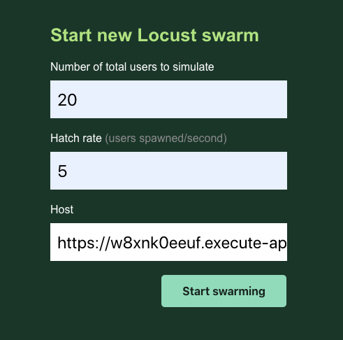
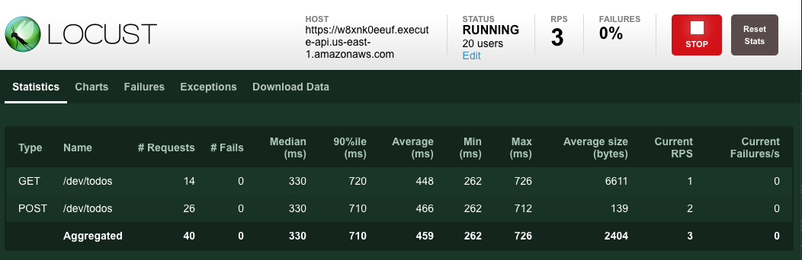

# run locust test on api gateway with header `x-api-key`

### Usage

1. deploy serverless first

Make sure you have aws account and [set the AWS_PROFILE properly](https://docs.aws.amazon.com/cli/latest/userguide/cli-chap-configure.html)

```
$ pushd serverless
$ npm install -g serverless
$ npm install
$ serverless deploy
$ popd
```

After deployed, you should see the api gateway url and its api key

If you missed the detail, you can run

```
$ sls info
Service Information
service: api-gateway-by-api-key
stage: dev
region: us-east-1
stack: api-gateway-by-api-key-dev
resources: 38
api keys:
  api-gateway-by-api-key-dev-api-key: M0wAqzfLRe2ZkX5SaYKqh8lDRic0X8bG6068x7LL
endpoints:
  POST - https://w8xnk0eeuf.execute-api.us-east-1.amazonaws.com/dev/todos
  GET - https://w8xnk0eeuf.execute-api.us-east-1.amazonaws.com/dev/todos
  GET - https://w8xnk0eeuf.execute-api.us-east-1.amazonaws.com/dev/todos/{id}
  PUT - https://w8xnk0eeuf.execute-api.us-east-1.amazonaws.com/dev/todos/{id}
  DELETE - https://w8xnk0eeuf.execute-api.us-east-1.amazonaws.com/dev/todos/{id}
functions:
  create: api-gateway-by-api-key-dev-create
  list: api-gateway-by-api-key-dev-list
  get: api-gateway-by-api-key-dev-get
  update: api-gateway-by-api-key-dev-update
  delete: api-gateway-by-api-key-dev-delete
layers:
  None
```
2. Update api key in file [locustfile.py](locustfile.py)

In this sample, the api key is `M0wAqzfLRe2ZkX5SaYKqh8lDRic0X8bG6068x7LL`

3. run the locust test

Make sure you have [installed locust](https://docs.locust.io/en/stable/installation.html)

```
locust
```

4. open browser with http://localhost:8089

host is the api server, in above sample, it is https://1ymxtrwh4e.execute-api.us-east-1.amazonaws.com





5. remove the api gateway

After finished the test, you can remove the api gateway

```
$ cd serverless
$ serverless remove
```
